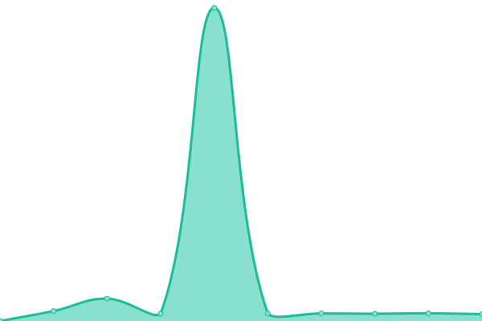
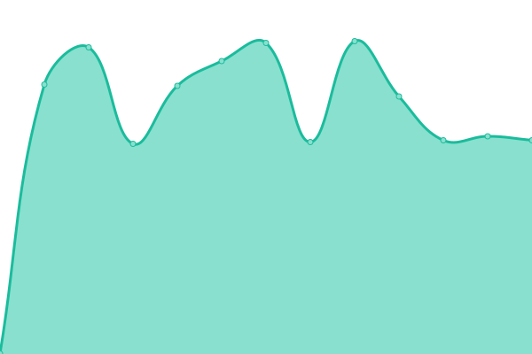
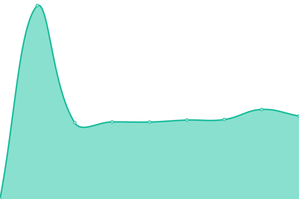
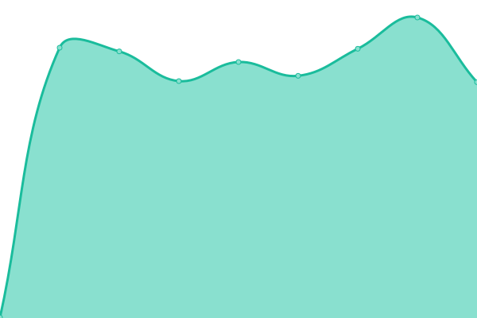

# [📈 Live Status](https://status.opentunnel.net): <!--live status--> **🟧 Partial outage**

This repository contains the open-source uptime monitor and status page for [roosterkid](https://status.opentunnel.net), powered by [Upptime](https://github.com/upptime/upptime).

With [Upptime](https://upptime.js.org), you can get your own unlimited and free uptime monitor and status page, powered entirely by a GitHub repository. We use [Issues](https://github.com/roosterkid/opentunnel-status-server/issues) as incident reports, [Actions](https://github.com/roosterkid/opentunnel-status-server/actions) as uptime monitors, and [Pages](https://status.opentunnel.net) for the status page.

<!--start: status pages-->
<!-- This summary is generated by Upptime (https://github.com/upptime/upptime) -->
<!-- Do not edit this manually, your changes will be overwritten -->
<!-- prettier-ignore -->
| URL | Status | History | Response Time | Uptime |
| --- | ------ | ------- | ------------- | ------ |
|  [HideSSH Website](https://hidessh.com/) | 🟩 Up | [hide-ssh-website.yml](https://github.com/4rukadi/uptime/commits/HEAD/history/hide-ssh-website.yml) | 

 778ms
     
 | 

<a href="https://status.hidessh.com/history/hide-ssh-website">100.00%</a>
    

|  [HideSSH blog](https://hidessh.com/blog/) | 🟩 Up | [hide-ssh-blog.yml](https://github.com/4rukadi/uptime/commits/HEAD/history/hide-ssh-blog.yml) | 

 1076ms
     
 | 

<a href="https://status.hidessh.com/history/hide-ssh-blog">100.00%</a>
    

|  [SSH 🇮🇩 Indonesia](http://id.hideserver.xyz:8080/) | 🟩 Up | [ssh-indonesia.yml](https://github.com/4rukadi/uptime/commits/HEAD/history/ssh-indonesia.yml) | 

 438ms
     
 | 

<a href="https://status.hidessh.com/history/ssh-indonesia">99.73%</a>
    

|  [SSH 🇮🇩 Indonesia 2](http://id2.hideserver.xyz:8080/) | 🟩 Up | [ssh-indonesia-2.yml](https://github.com/4rukadi/uptime/commits/HEAD/history/ssh-indonesia-2.yml) | 

 438ms
     
 | 

<a href="https://status.hidessh.com/history/ssh-indonesia-2">99.73%</a>
    

|  [SSH 🇮🇩 Indonesia 3](http://idku.hideserver.xyz:8080/) | 🟩 Up | [ssh-indonesia-3.yml](https://github.com/4rukadi/uptime/commits/HEAD/history/ssh-indonesia-3.yml) | 

 698ms
     
 | 

<a href="https://status.hidessh.com/history/ssh-indonesia-3">99.73%</a>
    

|  [SSH 🇮🇩 Indonesia 4](http://id4.hideserver.xyz:8080/) | 🟥 Down | [ssh-indonesia-4.yml](https://github.com/4rukadi/uptime/commits/HEAD/history/ssh-indonesia-4.yml) | 

 0ms
     
 | 

<a href="https://status.hidessh.com/history/ssh-indonesia-4">0.00%</a>
    

|  [SSH 🇸🇬4 Singapura 4](http://sg4.hideserver.xyz:8080/) | 🟥 Down | [ssh-4-singapura-4.yml](https://github.com/4rukadi/uptime/commits/HEAD/history/ssh-4-singapura-4.yml) | 

 416ms
     
 | 

<a href="https://status.hidessh.com/history/ssh-4-singapura-4">86.23%</a>
    

|  [SSH 🇸🇬5 Singapura 5](http://sg5.hideserver.xyz:8080/) | 🟥 Down | [ssh-5-singapura-5.yml](https://github.com/4rukadi/uptime/commits/HEAD/history/ssh-5-singapura-5.yml) | 

 421ms
     
 | 

<a href="https://status.hidessh.com/history/ssh-5-singapura-5">86.23%</a>
    

|  [SSH 🇸🇬 Singapura](http://sg.hideserver.xyz:8080/) | 🟥 Down | [ssh-singapura.yml](https://github.com/4rukadi/uptime/commits/HEAD/history/ssh-singapura.yml) | 

 0ms
     
 | 

<a href="https://status.hidessh.com/history/ssh-singapura">0.00%</a>
    

|  [SSH 🇸🇬2 Singapura 2](http://sg2.hideserver.xyz:8080/) | 🟩 Up | [ssh-2-singapura-2.yml](https://github.com/4rukadi/uptime/commits/HEAD/history/ssh-2-singapura-2.yml) | 

 419ms
     
 | 

<a href="https://status.hidessh.com/history/ssh-2-singapura-2">100.00%</a>
    

|  [SSH 🇸🇬3 Singapura 3](http://sg3.hideserver.xyz:8080/) | 🟩 Up | [ssh-3-singapura-3.yml](https://github.com/4rukadi/uptime/commits/HEAD/history/ssh-3-singapura-3.yml) | 

 414ms
     
 | 

<a href="https://status.hidessh.com/history/ssh-3-singapura-3">100.00%</a>
    

|  [SSH japan](http://jp.hideserver.xyz:8080/) | 🟥 Down | [ssh-japan.yml](https://github.com/4rukadi/uptime/commits/HEAD/history/ssh-japan.yml) | 

 412ms
     
 | 

<a href="https://status.hidessh.com/history/ssh-japan">86.50%</a>
    

|  [SSH Korea](http://kr.hideserver.xyz:8080/) | 🟥 Down | [ssh-korea.yml](https://github.com/4rukadi/uptime/commits/HEAD/history/ssh-korea.yml) | 

 405ms
     
 | 

<a href="https://status.hidessh.com/history/ssh-korea">86.51%</a>
    

|  [SSH India](http://in.hideserver.xyz:8080/) | 🟩 Up | [ssh-india.yml](https://github.com/4rukadi/uptime/commits/HEAD/history/ssh-india.yml) | 

 492ms
     
 | 

<a href="https://status.hidessh.com/history/ssh-india">99.45%</a>
    

|  [SSH Australia](http://au.hideserver.xyz:8080/) | 🟩 Up | [ssh-australia.yml](https://github.com/4rukadi/uptime/commits/HEAD/history/ssh-australia.yml) | 

 409ms
     
 | 

<a href="https://status.hidessh.com/history/ssh-australia">99.46%</a>
    

|  [SSH Canada](http://ca.hideserver.xyz:8080/) | 🟥 Down | [ssh-canada.yml](https://github.com/4rukadi/uptime/commits/HEAD/history/ssh-canada.yml) | 

 0ms
     
 | 

<a href="https://status.hidessh.com/history/ssh-canada">0.00%</a>
    

|  [SSH US](http://us.hideserver.xyz:8080/) | 🟩 Up | [ssh-us.yml](https://github.com/4rukadi/uptime/commits/HEAD/history/ssh-us.yml) | 

 81ms
     
 | 

<a href="https://status.hidessh.com/history/ssh-us">99.76%</a>
    

|  [OpenVPN Singapura 5](http://sg5.hideserver.xyz:8080/) | 🟥 Down | [open-vpn-singapura-5.yml](https://github.com/4rukadi/uptime/commits/HEAD/history/open-vpn-singapura-5.yml) | 

 382ms
     
 | 

<a href="https://status.hidessh.com/history/open-vpn-singapura-5">86.27%</a>
    

|  [OpenVPN Japan](http://jp.hideserver.xyz:8080/) | 🟥 Down | [open-vpn-japan.yml](https://github.com/4rukadi/uptime/commits/HEAD/history/open-vpn-japan.yml) | 

 383ms
     
 | 

<a href="https://status.hidessh.com/history/open-vpn-japan">86.28%</a>
    

|  [OpenVPN Korea](http://kr.hideserver.xyz:8080/) | 🟥 Down | [open-vpn-korea.yml](https://github.com/4rukadi/uptime/commits/HEAD/history/open-vpn-korea.yml) | 

 382ms
     
 | 

<a href="https://status.hidessh.com/history/open-vpn-korea">86.28%</a>
    

|  [OpenVPN India](http://in.hideserver.xyz:8080/) | 🟩 Up | [open-vpn-india.yml](https://github.com/4rukadi/uptime/commits/HEAD/history/open-vpn-india.yml) | 

 464ms
     
 | 

<a href="https://status.hidessh.com/history/open-vpn-india">99.76%</a>
    

<!--end: status pages-->

[**Visit our status website →**](https://status.opentunnel.net)

## 📄 License

- Powered by: [Upptime](https://github.com/upptime/upptime)
- Code: [MIT](./LICENSE) © [hidessh](https://status.hidessh.com)
- Data in the `./history` directory: [Open Database License](https://opendatacommons.org/licenses/odbl/1-0/)
